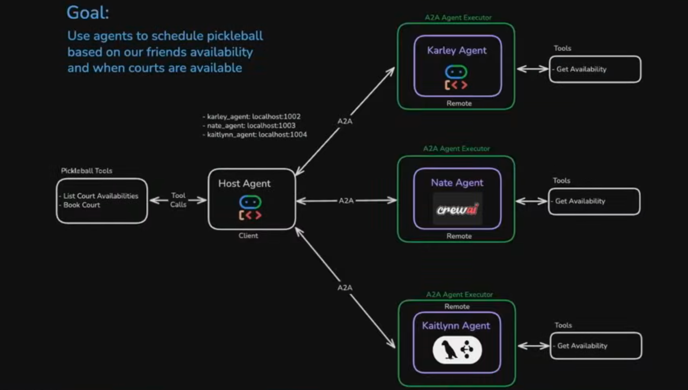
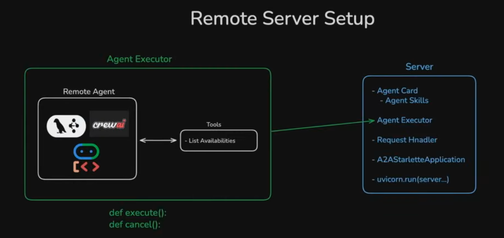

**Scheduling Multi-Agent**

Preview in VS Code: Cmd+Shift+V


A multi-agent sytem in which an ADK host agent in ADK Web using A2A protocol connects to thre remote agents and orchestrates a comunication between these external facing personal server agents to schedule a friends meeting

**Setup and Run Host Agent**

Use uv to create different frameworks and environments in the roots of each agent dir;
in the root of projet directory create a venv and save Google API key in .env:

uv pip install google-adk a2a-sdk
uv add "crewai[google-genai]"

uv venv
source .venc/bin/activate

Host agent is setup differently than the server agents. It has Prompts and Tools. The prompt consists of Core Instructions and dynamicly passing all the Available Agents remote urls. The tools are "hardwired" and a A2A send_message tool requests to the avilable agents:

The Host Agent is a Python regular Class, which defines an the ADK Host Agent.

Host Agent Workflow:

1. Create host Agent and pass in remote url for each friend agent
2. Prep Agent Creation:
   - for each url get AgentCard and save agent info, name, description to the python Host Agent class self.agents
3. Create ADK Agents:
   - pass in the list of remote agents self.agents to the Available Agents in the root instructions
4. Send Messsage
   - pass in agent name
   - make sure the remote connection is present
   - send A2A message

The ADK host agent can be created with `adk create host` in host_agent_adk dir
run with `adk web` in host_agent_adk dir

**Setup and Run Remote Agents**



```bash
echo 'GOOGLE_API_KEY="YOUR_API_KEY"' > .env
```

To create an ADK agent `adk create emma_adk_agent` in project dir

```shell
cd emma_adk_agent
uv venv
source .venv/bin/activate
uv run --active .
```

```shell
cd mike_crewai_agent
uv venv
source .venv/bin/activate
uv run active .
```

```shell
cd elliot_langgraph_agent
uv venv
source .venv/bin/activate
uv run app/__main__.py
```

Create a .env file in root of the projects of the host and the google agent directories with Google API Key:

**Deployment**

Each agent can have its own environment, but also can be part of one project environment, and it is run in a separate terminal. Once all agents are running, run the host to beging the scheduling process as it interacts with all agents.

```shell
cd host_adk_agent
uv venv
source .venv/bin/activate
uv run adk web
```
